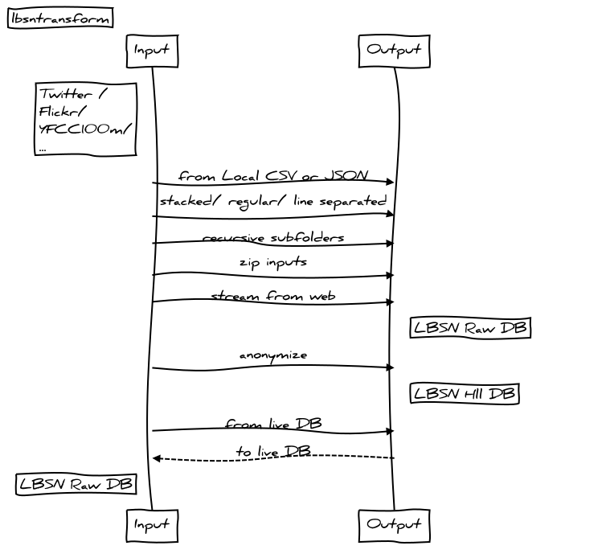

[](https://pypi.org/project/lbsntransform/) [](https://gitlab.vgiscience.de/lbsn/lbsntransform) [](https://gitlab.vgiscience.de/lbsn/lbsntransform) [](https://lbsn.vgiscience.org/lbsntransform/docs/)

# LBSNTransform

A python package that uses the [common location based social network (LBSN) data structure concept](https://pypi.org/project/lbsnstructure/) (ProtoBuf) to import, transform and export Social Media data such as Twitter and Flickr.



## Motivation

The goal is to provide a common interface to handle Social Media Data, without custom adjustment to the myriad API Endpoints available. As an example, consider the ProtoBuf spec "Post", which can be a Tweet on Twitter, a Photo shared on Flickr, or a post on Reddit. This tool is based on a 4-Facet conceptual framework for LBSN, introduced in a paper by [Dunkel et al. (2018)](https://www.tandfonline.com/doi/full/10.1080/13658816.2018.1546390). In addition, the GDPR directly requests Social Media Network operators to allow users to transfer accounts and data inbetween services.
While there are attempts by Google, Facebook etc. (see data-transfer-prject), it is not currently possible. With this structure concept, a primary motivation is to systematically characterize LBSN data aspects in a common scheme that enables privacy-by-design for connected software, data handling and database design.

## Description

This tool enables data import from a Postgres database, JSON, or CSV and export to CSV, [LBSN ProtoBuf](https://gitlab.vgiscience.de/lbsn/concept) or a [LBSN prepared Postgres Database](https://gitlab.vgiscience.de/lbsn/database-setup).
The tool will map Social Media endpoints (e.g. Twitter tweets) to a common [LBSN Interchange Structure](https://gitlab.vgiscience.de/lbsn/concept) format in ProtoBuf. The tool can also be imported to other Python projects with `import lbsntransform` for on-the-fly conversion.


## Quick Start

You can install the newest version with all its dependencies directly from the Git Repository:
```shell
pip install --upgrade git+git://gitlab.vgiscience.de:lbsn/lbsntransform.git
```

or install latest release using pip:
```shell
pip install lbsntransform
```

.. for non-developers, another option is to simply download the latest build and run with custom args,
e.g. with the following command line args

```shell
lbsntransform --origin 3 --file_input --file_type 'json' --transferlimit 1000 --csv_output
```

.. with the above input args, the the tool will:
- read local json from /01_Input/
- and store lbsn records as CSV and ProtoBuf in /02_Output/

A full list of possible input args is available in the [documentation](https://lbsn.vgiscience.org/lbsntransform/docs/)

## Built With

* [lbsnstructure](https://pypi.org/project/lbsnstructure/) - A common language independend and cross-network social-media datascheme
* [protobuf](https://github.com/google/protobuf) - Google's data interchange format
* [psycopg2](https://github.com/psycopg/psycopg2) - Python-PostgreSQL Database Adapter
* [ppygis3](https://github.com/AlexImmer/ppygis3) - A PPyGIS port for Python
* [shapely](https://github.com/Toblerity/Shapely) - Geometric objects processing in Python
* [emoji](https://github.com/carpedm20/emoji/) - Emoji handling in Python

## Contributing

Field mapping from and to ProtoBuffers from different Social Media sites is provided in classes [field_mapping_xxx.py](/lbsntransform/input/mapping/).
As an example, mapping of the Twitter json structure is given (see class `FieldMappingTwitter`). This class may be used to extend
functionality to cover other networks such as Flickr or Foursquare.

For development & testing, make a local clone of this repository
```shell
git clone git@gitlab.vgiscience.de:lbsn/lbsntransform.git
```
..and (e.g.) create package in develop mode to symlink the folder to your
Python's site-packages folder with:
```shell
python setup.py develop
```
(use `python setup.py develop --uninstall` to uninstall tool in develop mode)

Now you can run the tool in your shell with (Origin 3 = Twitter):
```shell
lbsntransform --origin 3 --file_input --file_type 'json' --transferlimit 1000 --csv_output
```

..or import the package to other python projects with:
```python
import lbsntransform
```

## Versioning and Changelog, and Download

For the releases available, see the [tags on this repository](/../tags).
The latest windows build that is available for download is [0.1.4](https://cloudstore.zih.tu-dresden.de/index.php/s/MqtlCyqLbxmnnxr/download).
For all other systems use cx_freeze to build executable:
```shell
python cx_setup.py build
```

The versioning (major.minor.patch) is automated using [python-semantic-release](https://github.com/relekang/python-semantic-release).
Commit messages that follow the [Angular Commit Message Conventions](https://github.com/angular/angular.js/blob/master/DEVELOPERS.md#-git-commit-guidelines) will be automatically interpreted, followed by version bumps if necessary. Examples:
- `fix: hotfix for bug xy` will result in a patch version bump
- `feat: feature for processing xy` will result in minor version bump
```git
perf(cluster): faster generation of alpha shapes

BRAKING CHANGE: Easy buffer option removed.
```
.. will result in a major release bump.

Some types used in this project:

```
feat: A new feature
fix: A bug fix
docs: Documentation only changes
style: Changes that do not affect the meaning of the code (white-space, formatting, missing semi-colons, etc)
refactor: A code change that neither fixes a bug nor adds a feature
perf: A code change that improves performance
test: Adding missing or correcting existing tests
chore: Changes to the build process or auxiliary tools and libraries such as documentation generation
```

Except for feature and fixes, no version bumps will be made.

## Authors

* **Alexander Dunkel** - Initial work

See also the list of [contributors](/../graphs/master).

## License

This project is licensed under the GNU GPLv3 or any higher - see the [LICENSE.md](LICENSE.md) file for details.