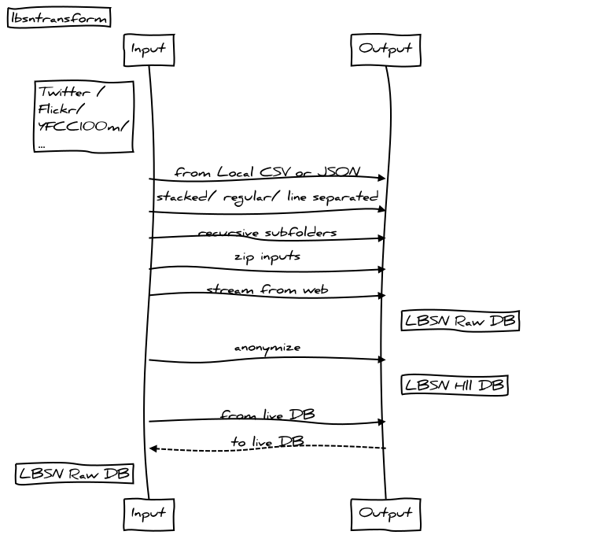

**lbsntransform** A python package that uses the [common location based social network (LBSN) data structure concept](https://pypi.org/project/lbsnstructure/) (ProtoBuf) to import, transform and export Social Media data such as Twitter and Flickr.

Import, convert and export Location Based Social Media (LBSM) data, such as from Twitter and Flickr, to a common data structure format (lbsnstructure). lbsntransform can also anonymize data into a privacy-aware version of lbsnstructure using HyperLogLog.

Input can be:  

- local CSV or Json (stacked/regular/line separated)  
- a web-url to CSV/Json  
- Postgres DB connection  

Output can be:  

- local CSV  
- local file with ProtoBuf encoded records  
- local SQL file ready for "Import from" in Postgres LBSN db  
- Postgres DB connection with existing [LBSN RAW Structure](https://gitlab.vgiscience.de/lbsn/databases/rawdb)  
- Postgres DB connection with existing [LBSN HLL Structure](https://gitlab.vgiscience.de/lbsn/databases/hlldb), which is a privacy-aware version of lbsnstructure  